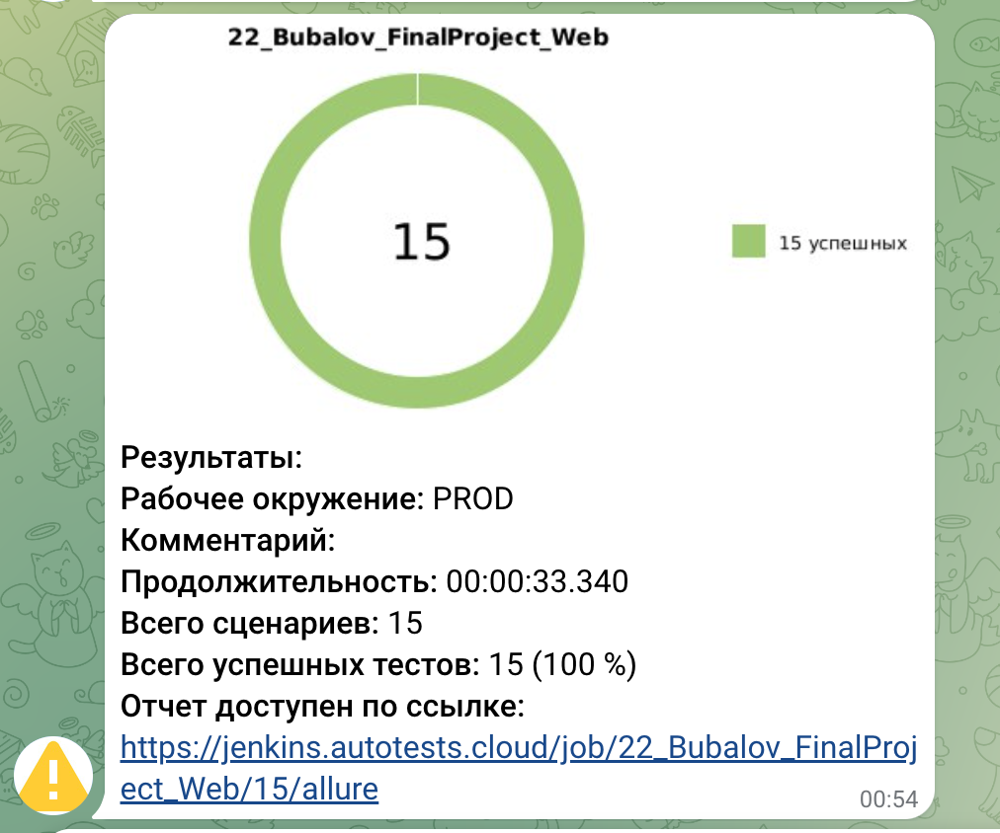

# Test automation project for [DemoQA](https://demoqa.com)

<p align="center">

</p>

> DemoQA is a demo site for QA engineers, learning selenium.\
> Made by Tools QA.\
> Consists of website with training forms and example of bookshop with open API.

# <a name="TableOfContents">Table of contents</a>

+ [Description](#Description)
+ [Tools and technologies](#tools-and-a-technologies)
+ [How to run](#how-to-run)
    + [Gradle command](#gradle-command)
    + [Run in Jenkins](#run-in-jenkins)
+ [Telegram Notifications](#telegram-notifications)
+ [Test results report in Allure Report](#test-results-report-in-allure-Report)
+ [Allure TestOps integration](#Allure-TestOps-integration)
    + [Project in Allure TestOps](#Project-in-Allure-TestOps)
    + [Dashboard](#Dashboard)
+ [Jira integration](#Jira)
+ [Video of running tests](#Video)

# <a name="Description">Description</a>

The test project consists of Web and API tests.\
A brief list of interesting facts about the project:

- [x] `Page Object` with steps using `Chain of Invocations`
- [x] Fake data generating with `Faker` library
- [x] Parametrized tests
- [x] Parametrized build
- [x] Different configuration files for test running depending on build parameters
- [x] `Allure TestOps` integration
- [x] Autotests as test documentation
- [x] Failing tests retries

# <a name="Technology">Tools and a technologies</a>

<p align="center">
  <code></code>
  <code></code>
  <code></code>
  <code></code>
  <code></code>
  <code></code>
  <code></code>
  <code></code>
  <code></code>
  <code></code>
  <code></code>
  <code></code>
</p>

The autotests in this project are written in `Java` using `Selenide` framework.\
`Gradle` - is used as a build automation tool.  \
`JUnit5` - to execute tests.\
`REST Assured` - for easy API testing of REST services.\
`Jenkins` - CI/CD for running tests remotely.\
`Selenoid` - to remote launching browsers in `Docker` containers.\
`Allure Report` - for test results visualisation.\
`Telegram Bot` - for test results notifications.\
`Allure TestOps` - as Test Management System.

[Back to the table of contents ⬆](#Table-Of-Contents)

# <a name="HowToRun">How to run</a>

## <a name="GradleCommand">Gradle command</a>

To run locally the following command can be is used:

```bash
gradle clean test
```
## <a name="GradleCommand">Remote run </a>

Remote run with additional parameters:

```bash
clean
test
-Dbrowser=${BROWSER} -DbrowserVersion=${BROWSER_VERSION} -DbrowserSize=${BROWSER_SIZE} -DwebDriver=${WEB_DRIVER}
```
>- *BROWSER* - browser for Web tests, chrome,firefox and opera supported (Default: chrome)
>- *BROWSER_VERSION* - version of browser for Web tests (Default: 100)
>- *BROWSER_SIZE* - size of browser for Web tests (Default: 1920x1080)

[Back to the table of contents ⬆](#Table-Of-Contents)


## <a name="RunInJenkins">Run in [Jenkins](https://jenkins.autotests.cloud/job/22_Bubalov_FinalProject_Web/)</a>

Main page of the build:
<p align="center">

</p>

A parametrized Jenkins job can be launched with needed ***parameters***:
<p align="center">

</p>

Sensitive config files are created in build workspace on build start.\
Relatively safe information transferred to the build by gradle arguments (see [Gradle command](#GradleCommand)
section, 'Additional parameters').

After the build is done the test results are available in:
>- <code><strong>*Allure Report*</strong></code>
>- <code><strong>*Allure TestOps*</strong></code> - results are uploaded there and the automated test-cases can be
   automatically updated accordingly to the recent changes in the code.
<p align="center">

</p>

[Back to the table of contents ⬆](#Table-Of-Contents)

# <a name="TelegramNotifications">Telegram Notifications</a>

Telegram bot sends a brief report to a specified telegram chat by results of each build.
<p align="center">

</p>

[Back to the table of contents ⬆](#Table-Of-Contents)

# <a name="AllureReport">Test results report in [Allure Report](https://jenkins.autotests.cloud/job/22_Bubalov_FinalProject_Web/allure/)</a>

## Main page

Main page of Allure report contains the following blocks:

>- <code><strong>*ALLURE REPORT*</strong></code> - displays date and time of the test, overall number of launched
   tests, and a diagram with percent and number of passed, failed or broken tests
>- <code><strong>*TREND*</strong></code> - displays trend of running tests for all runs
>- <code><strong>*SUITES*</strong></code> - displays distribution of tests by suites
>- <code><strong>*CATEGORIES*</strong></code> - displays distribution of unsuccessful tests by defect types
<p align="center">
  
</p>

## List of tests with steps and test artefacts

On the page the list of the tests grouped by suites with status shown for each test.\
Full info about each test can be shown: tags, severity, duration, detailed steps.

Also additional test artifacts are available:
>- Screenshot
>- Page Source
>- Browser console log
>- Video

<p align="center">
  
</p>

<p align="left">
  
</p>

[Back to the table of contents ⬆](#Table-Of-Contents)

# <a name="AllureTestOps">[Allure TestOps](https://allure.autotests.cloud/project/3919/dashboards) integration</a>

## <a name="AllureTestOpsProject">Project in Allure TestOps</a>

Test-cases in the project are imported and constantly updated from the code,
so there is no need in complex process of synchronization manual test-cases and autotests.\
It is enough to create and update an autotest in the code and the test-case in TMS always will be in actual state.\
Manual test-cases also can be added in TMS in case of need (via web interface or via code).
<p align="center">
  
</p>


## <a name="Dashboard">Dashboard</a>

Automation trends charts, distribution tests by some different parameters etc.:
<p align="center">
  
</p>

[Back to the table of contents ⬆](#Table-Of-Contents)

# <a name="Jira">Integration with [Jira](https://jira.autotests.cloud/browse/HOMEWORK-1041)</a>
<p align="center">
  
</p>
# <a name="Video">Video of running tests</a>

<p align="center">
  
</p>

[Back to the table of contents ⬆](#Table-Of-Contents)